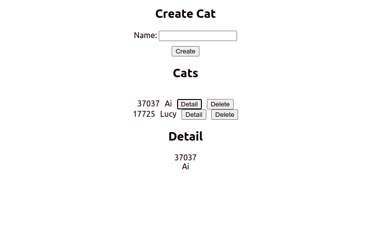

# tRPC Cats

## About

This is an example of a tRPC server and client with cats. Server persists data in a memory to manage kittens, and client sends data to the server.

To clone this repository, run:

```
git clone https://github.com/eavelasquez/trpc-cats.git
cd trpc-cats
```

## Folder structure

```
├── server
│   ├── src
│   │   ├── index.ts
│   │   └── router.ts
│   ├── package.json
│   ├── run.sh
│   └── tsconfig.json
├── client
│   ├── public
│   │   ├── index.html
│   │   └── manifest.json
│   ├── src
│   │   ├── cats
│   │   │   ├── Create.tsx
│   │   │   ├── Detail.tsx
│   │   │   └── List.tsx
│   │   ├── App.css
│   │   ├── App.tsx
│   │   ├── index.css
│   │   └── index.tsx
│   ├── package.json
│   └── tsconfig.json
└── README.md
```

## Server

Server is a Node.js application with TypeScript. It uses Express to handle HTTP requests.

To start the server with the following commands:

```
cd server && yarn install && yarn start
```

To test the server, run the following commands:

1. Create a new kitten running the following command:
    ```
    curl -X POST "http://localhost:8080/cat/create" -d '{"name": "Ai"}' -H 'content-type: application/json'
    ```

    output:
    ```
    {"id":null,"result":{"type":"data","data":{"cat":{"id":56404,"name":"Ai"},"message":"Cat created"}}}
    ```

1. Get list kittens running the following command:
    ```
    curl -X GET "http://localhost:8080/cat/list"
    ```

    output:
    ```
    {"id":null,"result":{"type":"data","data":{"cats":[{"id":56404,"name":"Ai"}],"total":1,"message":"Cats found"}}}
    ```

1. Get a kitten running the following command:
    ```
    curl -X GET "http://localhost:8080/cat/get?input=56404"
    ```

    output:
    ```
    {"id":null,"result":{"type":"data","data":{"cat":{"id":56404,"name":"Ai"},"message":"Found cat Ai"}}}
    ```

1. Update a kitten running the following command:
    ```
    curl -X POST "http://localhost:8080/cat/update" -d '{"id":56404, "name": "Lucy"}' -H 'content-type: application/json'
    ```

    output:
    ```
    {"id":null,"result":{"type":"data","data":{"cat":{"id":56404,"name":"Lucy"},"message":"Cat updated"}}}
    ```

1. Delete a kitten running the following command:
    ```
    curl -X POST  "http://localhost:8080/cat/delete" -d '{"id": 56404}' -H 'content-type: application/json'
    ```

    output:
    ```
    {"id":null,"result":{"type":"data","data":{"id":56404,"message":"Cat deleted"}}}
    ```

## Client

Client is a React application with TypeScript. This application uses the tRPC library to send requests to the server.

To run the client, run the following commands:

```
cd client && npm install && npm start
```

Open [http://localhost:3000](http://localhost:3000) to view it in the browser.



To builds the client, run the following commands:

```
cd client && npm run build
```

It will create a folder called `build` with the client built. The build is minified and optimized for production.
